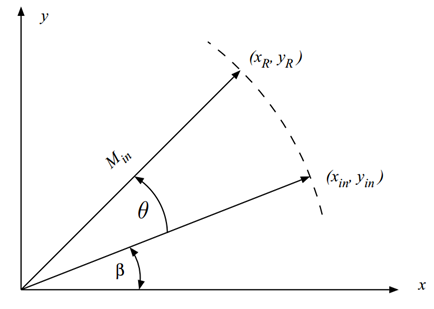
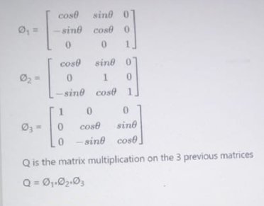

# Matrix Inversion
## 1-Vector Cordic
In the vectoring operation,apoint(x,y)is rotated till it reaches the x-axis.The outputs of the vectoring operation are the magnitude of the original vector as well as the phase that the original point formed with the x-axis.

### Algorithm:
The vectoring operation starts with apoint in the plane(x0,y0) and ends with apoint on the x-axis(xN,0). While rotating,the phase that the original point makes with the x-axis is also calculated as θN¼atany0x0.

In our case Vectoring cordic we use the sign of the Yin  to decide to add or to sub.

In first iteration we load the internal registers with the input x and y , then we start the 12 iterations using pip-line architecture to cut-out critical path into number of paths .

the equation we implement :

 

## 2-Rotational Cordic
Rotaional cordic is a sub-module to rotate a certain point with certain angle or to calculate the cos and sin of a certain angle by starting with a point on x axis with magnitude equal to 1.

### Algorithm:
	The cordic algorithm is an iterative algorithm that use the sign of a variable to decide the next operation.
	In our case rotational cordic we use the sign of angle theta to decide to add or to sub.
	In first iteration we load the internal registers with the input x , y and angle , then we start the 12 iterations using pip-line architecture to cut-out critical path into number of paths put with larger latency.

    Each iteration the angle is changing to reach zero after large number of iterations.
-	We used rotational cordic in our design to rotate matrix elements by a certain angle that output from vector cordic (appling Given’s rotation method).
-	Rotational cordic used also to calculate sin and cosine of theta angle to calculate the Q matrix in QR decomposition.
 ## 2-Q_matrix
 After rotational CORDIC stage we get sin and cos of each theta then we should create Phi matrix from it according to equations.
 
 We did this matrix multiplications outside hardware then we’d apply the result on hardware.

After multiply this matrixes we get an equation from sin and cos for each element.

Inside hardware we calculate the equation for each element in only one cycle after reading the sin and cos for each theta.
### Q_matrix module
We have many control i/o to control the functionality of the sub-module like start load finish read and done.
To load the sin and cos values from rot-CORDIC we set load signal and provide the number if iteration on addr bus.
After loading the 3 values of sin and the 3 values of cos we now rest load signal and set the start signal to start the calculations it takes one cycle.
Then we get done signal means it finishes the calculations then we reset start signal.
Then we can read the results any time by setting read signal the output matrix will be output as one element by clock cycle to reduce wires.
 
 ### Rinv_matrix module
 Once we have the upper traingular matrix after defined number of iterations from CORDIC we need to get the inverse of this matrix as our goal to get the inverse of the input matrix . 

 as hardware level using of dividers is not best case at all so we use vector cordic to calculate the diagonal of the  inverse matrix of any number as theta equle to tan(x/y) in this vectoring we consolidate the y value with the r we want to inverse and x  = 1 we will get the division withought using dividers .

 in our case we use 3 customed vectoring CORDIC and start to calculate the digonal  internal matrix and nuling the down matrix triangular. 

 the last 3 elements V12 , V13 and V23 we calculated it usign the following equations:

## FSM
-	Send start and read done from each block
-	Send location to write in (No. of loop)
-	Check if there’s zero in main diagonal to reduce logic.
-	send load after each loop to Q_mat and send start to start comp.
-	send read signal to Q_mat , R_inv to read word by word.
- control the flow of signals inside the top module and connection between modules.
- No. of states is 8 {IDLE, LOAD , VECT , ROT, INV, PREMUL, MULT , DN}.
  
## Multiplier Matrix 

after getting the QT and Rinv Matrceise we need to multiply them we pilpline this case to make all multiplication in one cylce by assigning the equations :

